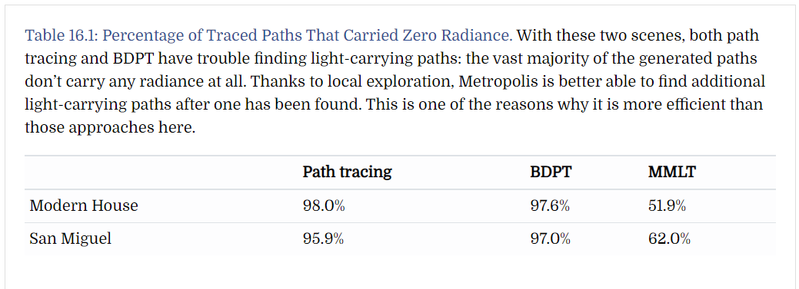
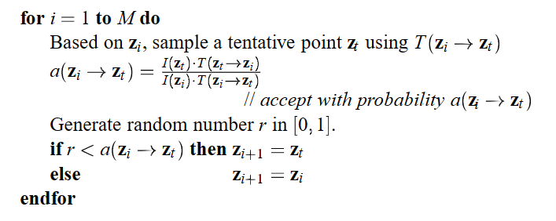
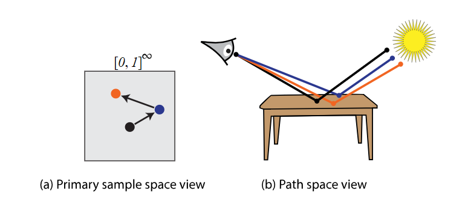

本作业完成的主要内容有：

-   完成了基本的MLT算法（主要是基于PSSMLT^放2002年的参考文献^，为了实现MLT顺带实现了BDPT（双向路径追踪））
-   实现BVH加速结构，加速结果达到10倍以上
-   实现对mesh的支持，支持渲染.obj文件
-   实现玻璃和导体材质
-   实现（不知道用来干嘛的）微表面理论
-   更新UI界面，添加mutation数量选项

## MLT

### 简介

Path Tracing存在的问题：

[table link](https://www.pbr-book.org/3ed-2018/Light_Transport_III_Bidirectional_Methods/Metropolis_Light_Transport#MultiplexedMLT)



在上述两个场景（可以放一下link中table前那几张对比的图片）中，无论是Path Tracing还是BDPT，都有大量光线携带0 radiance而浪费计算时间。MLT使用local exploration的方法可以极大地降低0 radiance路径的比例。

Metropolis Light Transport（MLT）算法是一种在计算机图形学中用于渲染逼真图像的全局光线追踪算法。它是由Veach和Guibas于1997年提出的，是基于蒙特卡罗方法的一种渐进光线追踪算法。它的核心思想是通过mutation操作来在已有的光线路径的基础上生成新的光线路径。

MLT算法的关键在于通过Metropolis-Hastings算法来控制状态转换的接受或拒绝。Metropolis-Hastings算法基于马尔可夫链蒙特卡罗方法，它使用一种称为接受概率的权重来决定是否接受状态转换。这样可以在路径空间中进行有效的探索，并提高采样效率。

但是，传统的MLT算法具有难以得到有效的mutation结果、start-up bias过大、无法遍历整个空间等问题，Kelemen等人在2002年提出一种新的mutation方法，被称为Primary Sample Space MLT (PSSMLT)，其核心思想在于将传统MLT中修改反射点的位置和方向的mutation操作替换为修改决定每一个反射点的反射光方向的随机数的mutation，这样做可以使得每次mutation得到的新光路都是可用的，且通过一定比例的Large Step使得光线路径可以遍历整个空间。

## 前置知识

首先看一下原来的MLT伪代码^如果要放参考文献的话，这个伪代码在2002年论文的第二页^：



$M$表示mutation数；设旧光路经过的反射点为$\{z_1,z_2,\cdots,z_i,\cdots\}$，选取其中一点$z_i$进行mutation操作变为其附近某一点$z_t$得到新光路，$T$表示进行这种转换的概率，但一般情况下$\forall x\forall y,T(x,y)$都是一个定值；$I(z_i)$和$I(z_t)$表示旧光路和新光路对相片上的某一pixel所做出的的scalar contribution，在PSSMLT中计算scalar contribution的方式是取光路对对应pixel的颜色贡献[R, G, B]中的最大值；$a(z_i\to z_t)$表示从旧光路转换到新光路的接受比例，最大为$1$；然后用一个随机数$r$和$a$比较，如果$r<a$，则接受新光路，否则拒绝新光路。

因此我们可以发现，如果$T(z_t\to z_i) = T(z_i\to z_t)$，那么新光路的scalar contribution越大，$a(z_i\to z_t)$就越高，如果$I(z_i) < I(z_t)$那么就一定接受新光路，所以新光路对照片的contribution总体上会一直变大直到极大值，而不会出现大量为contribution为$0$的光路。这样就解决了传统Pace Tracing中大部分从camera出发的光线都因为没有打到光源而被浪费的问题。

但是，上述算法仍存在以下问题：想要通过mutation找到一点$z_t$，使$z_t$仍在物体表面上且仍能使光路中的camera与光源连通，这在数学上是很难的事；如果初始路径选的不好，选取了contribution很小的路径，那再怎么mutation也仍然无法摆脱局部性和start-up bias；由于算法只做local exploration，所以并不能遍历整个空间的光照情况。

为了解决上述问题，PSSMLT引入对随机数向量而非反射点位置本身做mutation的方法，简化了mutation操作；并引入large step mutation操作，相当于是在与原光路完全无关的地方生成一条新光路，以达到遍历整个空间的效果。

[picture link](https://www.pbr-book.org/3ed-2018/Light_Transport_III_Bidirectional_Methods/pssmlt-idea.svg)



具体来看，由于光路在每个反射点的反射方向都是由某种分布加一些随机数实现的，所以对同一条光路，如果修改它的反射过程中用到的随机数向量中的某几个数值，那么它在某些顶点处的反射方向就会发生变化，因此就实现了从“对随机数空间的修改（图左）”到“对光路本身的mutation（图右）”的映射，而操作随机数是要比操作光路中的反射点的坐标容易许多的。

## PSSMLT的代码实现

```cpp
// 用双向路径追踪估计照片最后的平均亮度b，b用于最后AccumulatePathContribution中的计算
for (int i = 0; i < N_Init; i++) {
    InitRandomNumbers();
    Path eyeSubPath = GenerateEyePath(MaxVertex); // MaxVertex: 一条路径上允许的最大顶点数
    Path lightSubPath = GenerateLightPath(MaxVertex);
    double sc = CombinePaths(eyeSubPath, lightSubPath).sc; // 用双向路径追踪算法对两条子路径分别取前缀点、取后缀点生成最多MaxVertex^2条新路径，对这些新路径分别计算scalar contribution，取最大值加给b
    b += sc;
}
b /= double(N_Init);

// 初始化Markov链
TMarkovChain current, proposal;
InitRandomNumbersByChain(current); // 将Metropolis类中的随机数数组赋值给current中的随机数数组
current.C = CombinePaths(GenerateEyePath(MaxVertex), GenerateLightPath(MaxVertex)); // 用双向路径追踪生成新路径，每条未被遮挡的新路径都会在某一pixel(px, py)上做出contribution(c)，把所有有效的[px, py, c]赋值给current中记录PathContribution的数组C

// 对路径进行mutation操作
for (int i = 0; i < mutations; i++) {
    samps++; // 总采样次数
    double isLargeStepDone; // 取1或0，根据论文中的公式在有无进行large step mutation的情况下分别给contribution乘以不同的系数
    if (rnd() <= LargeStepProb) // 进行large step mutation的概率，LargeStepProb取0.3
    {
        proposal = large_step(current); // large_step()做的事就是重置current的所有随机数得到proposal，所以相当于生成一条全新的光路
        isLargeStepDone = 1.0;
    }
    else
    {
        proposal = mutate(current); // mutate()做的事就是根据论文中的公式对current中的随机数做扰动，得到proposal
        isLargeStepDone = 0.0;
    }
    InitRandomNumbersByChain(proposal); // 将Metropolis类中的随机数数组赋值给proposal中的随机数数组
    proposal.C = CombinePaths(GenerateEyePath(MaxVertex), GenerateLightPath(MaxVertex)); // 记录用两条子路径生成的所有有效的[px, py, c]
    
     // 计算接受新路径的概率
    double a;
    if (current.C.sc > 0.0)
        a = MAX(MIN(1.0, proposal.C.sc / current.C.sc), 0.0);

    // 根据论文中的公式将路径的contribution添加到照片上
    if (proposal.C.sc > 0.0)
        AccumulatePathContribution(pixels, proposal.C, (a + isLargeStepDone) / (proposal.C.sc / b + LargeStepProb));
    if (current.C.sc > 0.0)
        AccumulatePathContribution(pixels, current.C, (1.0 - a) / (current.C.sc / b + LargeStepProb));

    // 根据acceptance更新当前路径
    if (rnd() <= a)
        current = proposal;
}

// 对运行完后的图片进行gamma校正
double s = double(width * height) / double(samps);
for (int ix = 0; ix < spScene->renderOption.width; ix++) {
    for (int iy = 0; iy < spScene->renderOption.height; iy++) {
        double gamma = 2.2;
        pixels[ix + iy * width][0] = pow(1 - exp(-pixels[ix + iy * width][0] * s), 1 / gamma);
        pixels[ix + iy * width][1] = pow(1 - exp(-pixels[ix + iy * width][1] * s), 1 / gamma);
        pixels[ix + iy * width][2] = pow(1 - exp(-pixels[ix + iy * width][2] * s), 1 / gamma);
        pixels[ix + iy * width][3] = 1.0; // 最后一维是透明度，设成1.0
    }
}
```

代码中已经写了详细的注释，且在项目工程中每个函数的内部也有比较详细的注释，所以如果想了解具体的代码内容可以去读项目中的Metropolis.cpp以及其中的函数，因此在此处不再赘述。


根据最后的论文长度，如果需要的话，我还能添加以下内容：

-   什么是BDPT，CombinePaths中的BDPT具体是怎么实现的
-   mutate中perturb的公式
-   AccumulatePathContribution中系数的计算公式

## 运行结果

由于在BDPT中可以控制面光源的方向分布，所以可以得到不同类型的光源下的渲染结果，首先是漫反射面光源下的结果：

（等你p图）

另一种情况，如果认为面光源是某种激光面光源，它只朝正下方发射光线，那么渲染结果为：

（等我今天晚上渲染一下）


## 参考资料

-   Csaba Kelemen, László Szirmay-Kalos, György Antal and Ferenc Csonka. *A Simple and Robust Mutation Strategy for the Metropolis Light Transport Algorithm*, 2002
-   Eric Veach and Leonidas J. Guibas. *Metropolis Light Transport*, 1997
-   https://www.pbr-book.org/3ed-2018/Light_Transport_III_Bidirectional_Methods/Metropolis_Light_Transport#

